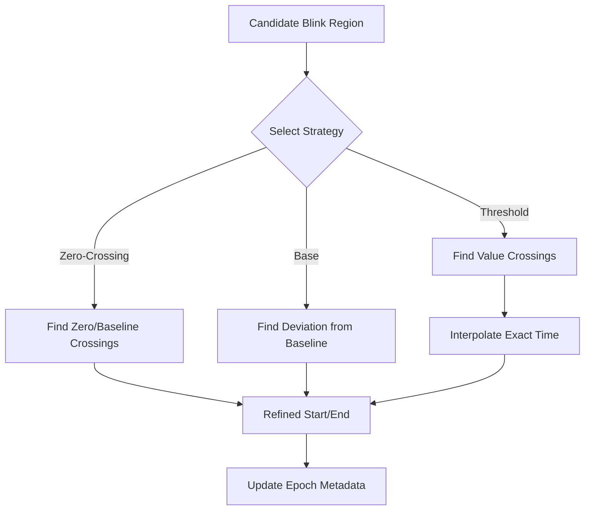

# Blink Segmentation and Refinement

## Purpose
Once a candidate blink region is identified, `pyblinker` refines the start and end points to ensure consistent feature extraction. Accurate segmentation is critical because metrics like "duration", "closing speed", and "amplitude" depend entirely on these boundaries.

### Landmark renaming reference (Blinker ➜ PyBlinker)

| Original Blinker name | PyBlinker name (landmark)         |
|-----------------------| --------------------------------- |
| right base            | end__right_base__eeg              |
| left base             | start__left_base__eeg             |
| right zero            | end__right_zero__eeg              |
| left zero             | start__left_zero__eeg             |
| right_X_intercept     | end__right_x_intercept__eeg       |
| left_X_intercept      | start__left_x_intercept__eeg      |
| RIGHT_BASE_HALF_HEIGHT | end__right_base_half_height__eeg  |
| LEFT_BASE_HALF_HEIGHT | start__left_base_half_height__eeg |
| RIGHT_ZERO_HALF_HEIGHT | end__right_zero_half_height__eeg  |
| LEFT_ZERO_HALF_HEIGH  | start__left_zero_half_height__eeg |
| X_INTERSECT           | x_intersect__eeg                  |
| Y_INTERSECT           | y_intersect__eeg                  |

---

### Feature-style names (preferred for calculation)

| Feature name                    | Derived from                                                         |
| ------------------------------- | -------------------------------------------------------------------- |
| onset__base__eeg                | start__left_base__eeg                                                |
| duration__base__eeg             | end__right_base__eeg − start__left_base__eeg                         |
| onset__zero__eeg                | start__left_zero__eeg                                                |
| duration__zero__eeg             | end__right_zero__eeg − start__left_zero__eeg                         |
| onset__x_intercept__eeg         | start__left_x_intercept__eeg                                         |
| duration__x_intercept__eeg      | end__right_x_intercept__eeg − start__left_x_intercept__eeg           |
| onset__base_half_height__eeg    | start__left_base_half_height__eeg                                    |
| duration__base_half_height__eeg | end__right_base_half_height__eeg − start__left_base_half_height__eeg |
| onset__zero_half_height__eeg    | start__left_zero_half_height__eeg                                    |
| duration__zero_half_height__eeg | end__right_zero_half_height__eeg − start__left_zero_half_height__eeg |

---

### Note

We include the **left** and **right** in the landmark naming convention so that we not confuse with the convention use in **Blinker**.

## Segmentation Strategies
Different modalities and research questions require different definitions of "start" and "end". `pyblinker` supports several strategies, specified during the refinement step:

*   **`"base"`**: Uses the "outer" limits, capturing the full deviation from baseline before the main rise/fall.
*   **`"zero"`**: Uses **zero-crossing** (or threshold-crossing) points. This is the standard definition for blink duration in many EOG studies.
*   **`"tent"`**: Fits a tent-like shape (peak and linear slopes) to define the event.
*   **`"half_base"` / `"half_zero"`**: Defines boundaries at 50% of the peak amplitude relative to the base or zero-crossing level (Full Width at Half Maximum - FWHM).
*   **`"threshold_interpolation"` (EAR specific)**: Finds the precise time where the signal crosses a specific EAR threshold, using interpolation to achieve sub-sample accuracy.

## Refinement Process
Refinement typically happens when converting continuous data into epochs (`slice_raw_into_mne_epochs_refine_annot`).

1.  **Input**: Raw signal and candidate blink regions (coarse onsets/offsets).
2.  **Search**: For each candidate, the algorithm searches within a small window (expanding if necessary) for the precise landmarks defined by the strategy.
3.  **Result**: New metadata fields (e.g., `blink_onset_ear`, `refined_start_sample`, `interpolated_closing_slope`) are attached to the epochs.

### EAR threshold landmark naming update
* **Feature/Change**: EAR refinement now records threshold landmarks using the new keys (`start__th_point__ear`, `end__th_point__ear`, `trough__th_point__ear`, `onset__th__ear`, `duration__th__ear`) plus interpolation timing (`onset__th_interpolation__ear`, `duration__th_interpolation__ear`). Legacy fields may still exist but are no longer required for correctness.
* **Related Code**: `pyblinker/segmentation/refinement/ear/epoch.py`, `pyblinker/segmentation/refinement/ear/threshold.py`.
* **Verification (Tutorials & Tests)**: `tutorial/03c_ear_threshold_multi_candidate_refinement.py`, `test/segmentation/test_refine_annot_by_channel.py`.

### EAR fallback threshold metadata
* **Feature/Change**: When threshold-based refinement is unavailable, EAR fallback refinement now populates the `start__th_point__ear` and `end__th_point__ear` landmarks so downstream morphology and kinematic pipelines can rely on consistent keys.
* **Related Code**: `pyblinker/segmentation/refinement/ear/epoch.py` (`_fallback_refinement`).
* **Verification (Tutorials & Tests)**: `tutorial/03a_ear_threshold_blink_refinement.py`, `test/blink_features/morphology/test_epoch_morphology_features_aggregation.py`.

### Tuning Parameters
Users can tune the refinement behavior, especially for EAR:
*   **Threshold**: The EAR value defining "closed" vs. "open".
*   **Extension**: How far to search outside the candidate region if the crossing isn't found immediately.

### Flowchart

### Metadata accumulation (row-wise -> column-wise)
* Per-epoch metadata is now built as an **isolated `row_data` dict**, avoiding direct writes into the global metadata frame. Each blink produces a small dictionary (onset, duration, extremum, outer bounds, and EAR thresholds), and the list of those dictionaries is **transposed** into column lists before updating the epoch row. This makes it trivial to add new blink fields without pre-allocating columns or juggling indices.
* No pre-allocation or `append_to_slot`: epoch metadata starts from an empty dict and is filled with lists only—no `[np.nan] * n` scaffolding or index-based writes.
* Related code: `pyblinker/segmentation/refinement/epochs.py` (core epoch refinement flow), `pyblinker/segmentation/refinement/eeg/refinement.py` (`_append_peak_refinements`), `pyblinker/segmentation/refinement/ear/epoch.py` (`_append_ear_refinements`).
* Tests: `test/segmentation/test_refine_annot_by_channel.py`.

## Single-channel modality configuration

`slice_raw_into_mne_epochs_refine_annot` now treats modality blocks as opt-in. The helper `_prepare_epochs_and_modalities` in `pyblinker/segmentation/refinement/prep.py` enforces:

* Modalities missing from the segmentation config, marked as no-op (`seg_type=[]` or `""`), or carrying `channel=None` are skipped without attempting channel validation or data picking.
* When enabled, each modality still requires an explicit, single-channel selection; missing/empty or non-unique channels raise `ValueError`.
* Each enabled modality extracts epoch data with `epochs.get_data(picks=[idx])`, so downstream refinement receives a 1D vector per epoch—no implicit averaging across channels.
* Blink annotations are filtered by `blink_label` prior to per-epoch refinement; onsets/durations stay in seconds, while epoch-local bounds remain in samples.
* **Practical examples**:
  * `tutorial/05a_ear_energy_feature_tutorial.py` shows how to build a segmentation config when only EAR is available, or when optional EEG/EOG channels are present but left as no-op.
  * `tutorial/05b_eeg_energy_feature_tutorial.py` shows an EEG-focused setup; omitting ``seg_type`` (or providing a non-empty value) keeps EEG refinement enabled, while ``seg_type=[]`` disables EEG entirely.

### EAR threshold configuration
* `slice_raw_into_mne_epochs_refine_annot` no longer accepts an `ear_threshold` convenience argument; EAR thresholds must be defined inside the segmentation config under the `"ear"` key (including `seg_type="threshold_interpolation"` and extension/padding settings) before calling the helper. The configuration in `tutorial/5_ear_energy_feature_tutorial.py` shows the full set of recommended EAR parameters alongside optional EEG/EOG entries.
* Code: `pyblinker/segmentation/refinement/prep.py` (`_prepare_segmentation_config`), `pyblinker/segmentation/refinement/epochs.py` (`slice_raw_into_mne_epochs_refine_annot`).
* Unit tests: `test/blink_feature_ear/energy/test_energy_features.py` builds the explicit EAR segmentation config when refining epochs for energy metrics.

### Verification
* Code: `pyblinker/segmentation/refinement/prep.py` (`_prepare_epochs_and_modalities`, `_modality_enabled`), `pyblinker/segmentation/refinement/refine_epoch.py` (`_refine_epoch_modalities`), `pyblinker/segmentation/refinement/epochs.py` (`slice_raw_into_mne_epochs_refine_annot`).
* Tutorials: `tutorial/05c_minimal_blink_feature_tutorial.py`, `tutorial/5_ear_energy_feature_tutorial.py`.
* Tests: `test/segmentation/test_ear_refinement_outputs.py`, `test/segmentation/test_refine_annot_by_channel.py`, `test/segmentation/test_slice_raw_config_variants.py`.

## Related Code

*   **`pyblinker/segmentation/refinement/epochs.py`**: The core module for refinement. Contains `slice_raw_into_mne_epochs_refine_annot` and shared modality orchestration helpers.
*   **`pyblinker/segmentation/refinement/eeg/refinement.py`**: EEG/EOG-specific peak refinement helpers, including `_append_peak_refinements` and `refine_local_maximum_stub`.
*   **`pyblinker/segmentation/refinement/ear/epoch.py`**: EAR-specific interpolation helpers used by the segmentation pipeline.
*   **`pyblinker/fitutils/`**: Contains utility functions for fitting shapes and finding crossings (e.g., `ear_crossing.py`).
*   **`pyblinker/segmentation/refinement/ear/threshold.py`**: Implementation of EAR-specific refinement logic used by the segmentation helpers.

## Tutorials

*   **`tutorial/03b_ear_threshold_crossing_tutorial.py`**:
    A detailed, executable exploration of the "threshold interpolation" strategy. It generates synthetic EAR signals and visualizes exactly how the "left crossing", "minimum", and "right crossing" are calculated using linear interpolation between samples.
*   **`tutorial/03a_ear_threshold_blink_refinement.py`**:
    Shows how to apply the refinement logic to real data. It demonstrates the effect of changing the `threshold` parameter on the detected blink duration.
*   **`tutorial/03c_ear_threshold_multi_candidate_refinement.py`**:
    Covers complex scenarios: what happens when a single candidate region actually contains two distinct blinks (double blink)? This tutorial demonstrates the logic that splits or selects the appropriate event.
*   **`tutorial/03d_understand_diff_in_blink_position.py`**:
    A comparative script that runs different segmentation strategies (e.g., "zero-crossing" vs. "50% recovery") on the same blink, printing the start/end times side-by-side to highlight the impact of the chosen definition.

## Unit Tests

*   **`test/segmentation/test_ear_refinement_outputs.py`**:
    Verifies that EAR-based epoch slicing and multi-threshold refinement outputs match the stored FIF and CSV reference artifacts.
*   **`test/test_refined_blink_flow.py`**:
    The primary integration test for the refinement module. It mocks a user workflow: Input coarse annotations -> Run Refinement -> Check output metadata.
*   **`test/test_ear_threshold_refinement.py`**:
    Tests the robustness of the threshold search. It includes test cases for edge conditions: signals that barely cross the threshold, signals that cross multiple times, and signals that start below the threshold.
*   **`test/test_ear_crossing.py`**:
    Validates the low-level math functions (like `find_threshold_crossing_triplet`). It ensures that the sub-sample interpolation is mathematically correct.
*   **`test/segmentation/test_refine_annot_by_channel.py`**:
    Verifies that refinement can be applied independently to different channels (e.g., refining an EEG blink using EEG data while simultaneously refining an EAR blink using video data) without cross-contamination.
*   **`test/segmentation/test_slice_raw_config_variants.py`**:
    Confirms that `slice_raw_into_mne_epochs_refine_annot` safely handles partial or no-op segmentation configs without attempting to validate or pick missing modalities.
