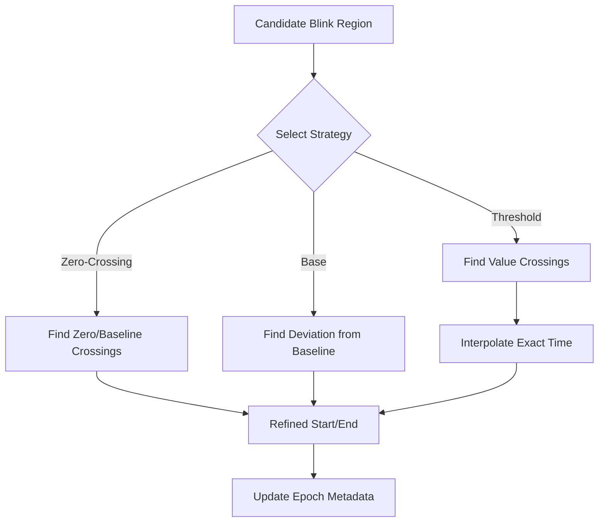

# Blink Segmentation and Refinement

## Purpose
Once a candidate blink region is identified, `pyblinker` refines the start and end points to ensure consistent feature extraction. Accurate segmentation is critical because metrics like "duration", "closing speed", and "amplitude" depend entirely on these boundaries.

## Segmentation Strategies
Different modalities and research questions require different definitions of "start" and "end". `pyblinker` supports several strategies, specified during the refinement step:

*   **`"base"`**: Uses the "outer" limits, capturing the full deviation from baseline before the main rise/fall.
*   **`"zero"`**: Uses **zero-crossing** (or threshold-crossing) points. This is the standard definition for blink duration in many EOG studies.
*   **`"tent"`**: Fits a tent-like shape (peak and linear slopes) to define the event.
*   **`"half_base"` / `"half_zero"`**: Defines boundaries at 50% of the peak amplitude relative to the base or zero-crossing level (Full Width at Half Maximum - FWHM).
*   **`"threshold_interpolation"` (EAR specific)**: Finds the precise time where the signal crosses a specific EAR threshold, using interpolation to achieve sub-sample accuracy.

## Refinement Process
Refinement typically happens when converting continuous data into epochs (`slice_raw_into_mne_epochs_refine_annot`).

1.  **Input**: Raw signal and candidate blink regions (coarse onsets/offsets).
2.  **Search**: For each candidate, the algorithm searches within a small window (expanding if necessary) for the precise landmarks defined by the strategy.
3.  **Result**: New metadata fields (e.g., `blink_onset_ear`, `refined_start_sample`, `interpolated_closing_slope`) are attached to the epochs.

### Tuning Parameters
Users can tune the refinement behavior, especially for EAR:
*   **Threshold**: The EAR value defining "closed" vs. "open".
*   **Extension**: How far to search outside the candidate region if the crossing isn't found immediately.

### Flowchart

## Related Code

*   **`pyblinker/utils/refinement_utils.py`**: The core module for refinement. Contains `slice_raw_into_mne_epochs_refine_annot` and specific refinement functions like `refine_ear_extrema_and_threshold_stub`.
*   **`pyblinker/fitutils/`**: Contains utility functions for fitting shapes and finding crossings (e.g., `ear_crossing.py`).
*   **`pyblinker/blink_features/ear_metrics/refinement.py`**: Implementation of EAR-specific refinement logic (referenced by `refinement_utils`).

## Tutorials

*   **`tutorial/ear_threshold_crossing_tutorial.py`**:
    A detailed, executable exploration of the "threshold interpolation" strategy. It generates synthetic EAR signals and visualizes exactly how the "left crossing", "minimum", and "right crossing" are calculated using linear interpolation between samples.
*   **`tutorial/ear_threshold_blink_refinement.py`**:
    Shows how to apply the refinement logic to real data. It demonstrates the effect of changing the `threshold` parameter on the detected blink duration.
*   **`tutorial/ear_threshold_multi_candidate_refinement.py`**:
    Covers complex scenarios: what happens when a single candidate region actually contains two distinct blinks (double blink)? This tutorial demonstrates the logic that splits or selects the appropriate event.
*   **`tutorial/understand_diff_in_blink_position.py`**:
    A comparative script that runs different segmentation strategies (e.g., "zero-crossing" vs. "50% recovery") on the same blink, printing the start/end times side-by-side to highlight the impact of the chosen definition.

## Unit Tests

*   **`test/test_refined_blink_flow.py`**:
    The primary integration test for the refinement module. It mocks a user workflow: Input coarse annotations -> Run Refinement -> Check output metadata.
*   **`test/test_ear_threshold_refinement.py`**:
    Tests the robustness of the threshold search. It includes test cases for edge conditions: signals that barely cross the threshold, signals that cross multiple times, and signals that start below the threshold.
*   **`test/test_ear_crossing.py`**:
    Validates the low-level math functions (like `find_threshold_crossing_triplet`). It ensures that the sub-sample interpolation is mathematically correct.
*   **`test/epoch_refine_annotation/test_refine_annot_by_channel.py`**:
    Verifies that refinement can be applied independently to different channels (e.g., refining an EEG blink using EEG data while simultaneously refining an EAR blink using video data) without cross-contamination.
