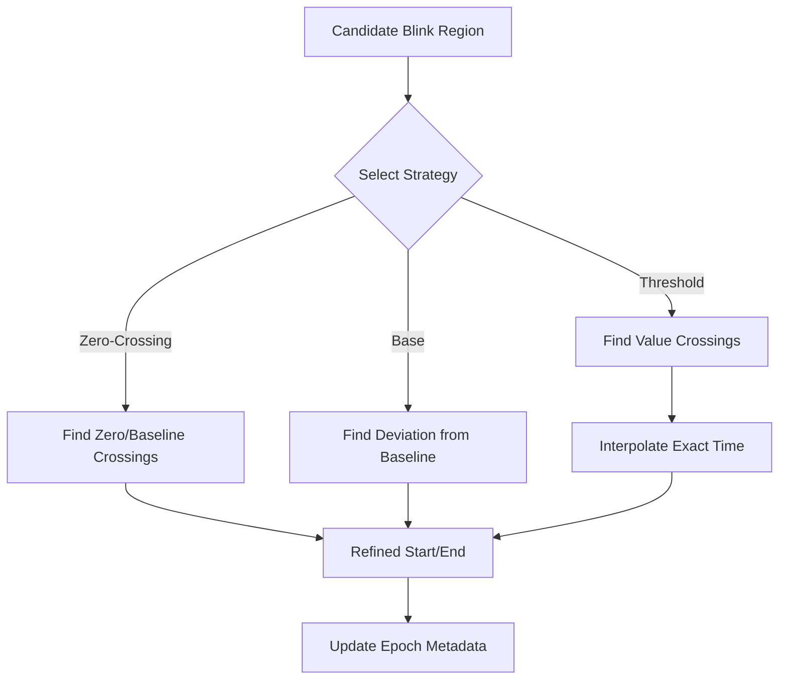

# Blink Segmentation and Refinement

## Purpose
Once a candidate blink region is identified, `pyblinker` refines the start and end points to ensure consistent feature extraction. Accurate segmentation is critical because metrics like "duration", "closing speed", and "amplitude" depend entirely on these boundaries.

## Segmentation Strategies
Different modalities and research questions require different definitions of "start" and "end". `pyblinker` supports several strategies, specified during the refinement step:

*   **`"base"`**: Uses the "outer" limits, capturing the full deviation from baseline before the main rise/fall.
*   **`"zero"`**: Uses **zero-crossing** (or threshold-crossing) points. This is the standard definition for blink duration in many EOG studies.
*   **`"tent"`**: Fits a tent-like shape (peak and linear slopes) to define the event.
*   **`"half_base"` / `"half_zero"`**: Defines boundaries at 50% of the peak amplitude relative to the base or zero-crossing level (Full Width at Half Maximum - FWHM).
*   **`"threshold_interpolation"` (EAR specific)**: Finds the precise time where the signal crosses a specific EAR threshold, using interpolation to achieve sub-sample accuracy.

## Refinement Process
Refinement typically happens when converting continuous data into epochs (`slice_raw_into_mne_epochs_refine_annot`).

1.  **Input**: Raw signal and candidate blink regions (coarse onsets/offsets).
2.  **Search**: For each candidate, the algorithm searches within a small window (expanding if necessary) for the precise landmarks defined by the strategy.
3.  **Result**: New metadata fields (e.g., `blink_onset_ear`, `refined_start_sample`, `interpolated_closing_slope`) are attached to the epochs.

### Tuning Parameters
Users can tune the refinement behavior, especially for EAR:
*   **Threshold**: The EAR value defining "closed" vs. "open".
*   **Extension**: How far to search outside the candidate region if the crossing isn't found immediately.

### Flowchart

## Related Code

*   **`pyblinker/utils/refinement_utils.py`**: The core module for refinement. Contains `slice_raw_into_mne_epochs_refine_annot` and specific refinement functions like `refine_ear_extrema_and_threshold_stub`.
*   **`pyblinker/fitutils/`**: Contains utility functions for fitting shapes and finding crossings (e.g., `ear_crossing.py`).
*   **`pyblinker/blink_features/ear_metrics/refinement.py`**: Implementation of EAR-specific refinement logic (referenced by `refinement_utils`).
