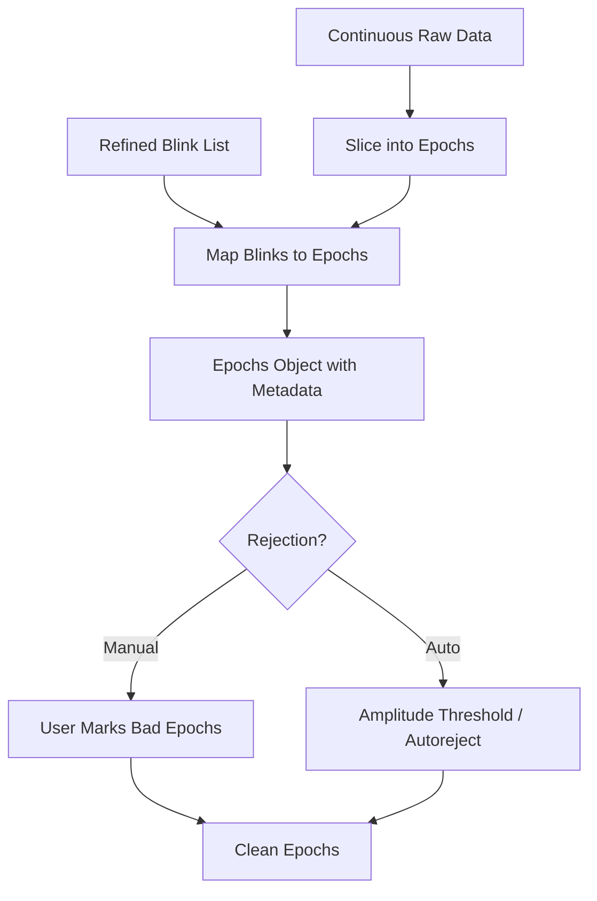

. # Epoch-Based Pipeline

## Purpose
While blinks occur in a continuous stream, `pyblinker` emphasizes an **epoch-based** workflow. This approach aligns with standard MNE-Python practices and offers significant advantages for analysis and quality control.

## Why Epochs?

1.  **Stationarity**: Processing shorter segments (e.g., 30 seconds) reduces the impact of long-term signal drift and non-stationarity.
2.  **Quality Control**: It is easier to visualize, assess, and accept/reject discrete chunks of data than to scour hours of continuous recording.
3.  **Aggregation**: Features can be easily aggregated per trial or condition (e.g., "average blink duration during the 'fatigue' condition").
4.  **MNE Integration**: MNE's `Epochs` object provides a robust structure for handling metadata, channel selection, and rejection.

## Epoch Creation and Alignment
The transition from continuous data to epochs involves:
1.  **Slicing**: The raw data is cut into fixed-length segments (default 30s) or segments locked to experimental events.
2.  **Metadata Alignment**: `pyblinker` calculates which blinks fall into which epoch and updates the epoch metadata with `blink_onset`, `blink_duration`, and other properties relative to the epoch start.

### EEG landmark metadata in epochs
* **Feature/Change**: Epoch metadata now includes EEG landmark columns (`startleftbaseeeg`, `endrightbaseeeg`, `startleftzeroeeg`, `endrightzeroeeg`, `startleftxintercepteeg`, `endrightxintercepteeg`, `startleftbasehalfheighteeg`, `endrightbasehalfheighteeg`, `startleftzerohalfheighteeg`, `endrightzerohalfheighteeg`, `xintersecteeg`, `yintersecteeg`) when EEG refinement is enabled. Values are stored as sample indices relative to the epoch start (with intersection y-values as signal amplitudes).
* **Related Code**: `pyblinker/segmentation/refinement/epochs.py`, `pyblinker/segmentation/refinement/refine_epoch.py`, `pyblinker/segmentation/refinement/eeg/refinement.py`.
* **Verification (Tutorials & Tests)**: `tutorial/03d_eeg_plotting_all_landmark_epochs.py`, `test/segmentation/test_eeg_refinement_outputs.py`.

### Channel selection per modality
Epoch creation now expects an explicit, single-channel configuration per modality via the segmentation settings passed to `slice_raw_into_mne_epochs_refine_annot`:

* **EAR**: A `"channel"` is required; missing or ambiguous entries raise `ValueError`.
* **EEG/EOG**: Optional. Omitting the channel disables refinement for that modality; invalid or multi-match channels raise `ValueError`.
* The helper `_prepare_epochs_and_modalities` (in `pyblinker/segmentation/refinement.py`) creates epochs, filters annotations by `blink_label`, and extracts per-epoch data with shape `(n_epochs, 1, n_times)` so downstream refinement works on 1D vectors.

This keeps modality pipelines independent and deterministic while preserving existing epoch layouts.

## Epoch Rejection
Bad epochs (due to muscle noise, disconnects, or excessive movement) should be excluded from analysis.

*   **Manual Rejection**: Users can scroll through epochs in MNE's visualizer and mark bad ones (`epochs.plot()`).
*   **Automatic Rejection**: While `pyblinker` does not enforce a specific auto-rejection algorithm, users often employ standard MNE methods (peak-to-peak amplitude rejection) or external MNE-compatible libraries like **Autoreject** (which learns rejection thresholds automatically).

### Flowchart

## Related Code

*   **`pyblinker/utils/epoch_utils.py`**: Utilities for slicing raw data and managing epoch structures.
*   **`pyblinker/segmentation/refinement.py`**: Contains `slice_raw_into_mne_epochs_refine_annot`, which handles the simultaneous creation of epochs and alignment of refined blink metadata.

## Tutorials

*   **`tutorial/04_epoching_and_blink_validation_report.py`**:
    The comprehensive guide to the epoching workflow. It demonstrates:
    1.  Defining epoch length (e.g., 30s).
    2.  Calling `slice_raw_into_mne_epochs_refine_annot`.
    3.  Inspecting the resulting `epochs.metadata` to see how blink onsets (originally in absolute time) have been converted to epoch-relative time.

## Unit Tests

*   **`test/epoch_blink_finder/test_blink_finder.py`**:
    Tests the logic that detects blinks *within* already-epoched data, ensuring that the boundaries of the epoch do not artificially cut off blink detection.
*   **`test/epoch_blink_finder/test_blink_finder_drop.py`**:
    Specifically validates the logic for **dropping** epochs. For instance, if a blink is detected but its signal quality is too poor (e.g., extreme amplitude), this test ensures the corresponding epoch is flagged or removed.
*   **`test/segmentation/test_ear_refinement_outputs.py`**:
    Confirms that channel-explicit epoching preserves reference FIF/CSV outputs when EAR, EEG, and EOG are configured independently.
*   **`test/utils/test_slice_raw_into_mne_epochs.py`**:
    Unit tests for the `slice_raw_...` utility. Checks that sample indices are calculated correctly to avoid one-sample off errors when cutting continuous data.
*   **`test/utils/test_metadata_utils.py`**:
    Tests the helper functions that attach the complex blink metadata (lists of start/end times per epoch) to the MNE Epochs object, ensuring serialization and retrieval work as expected.
