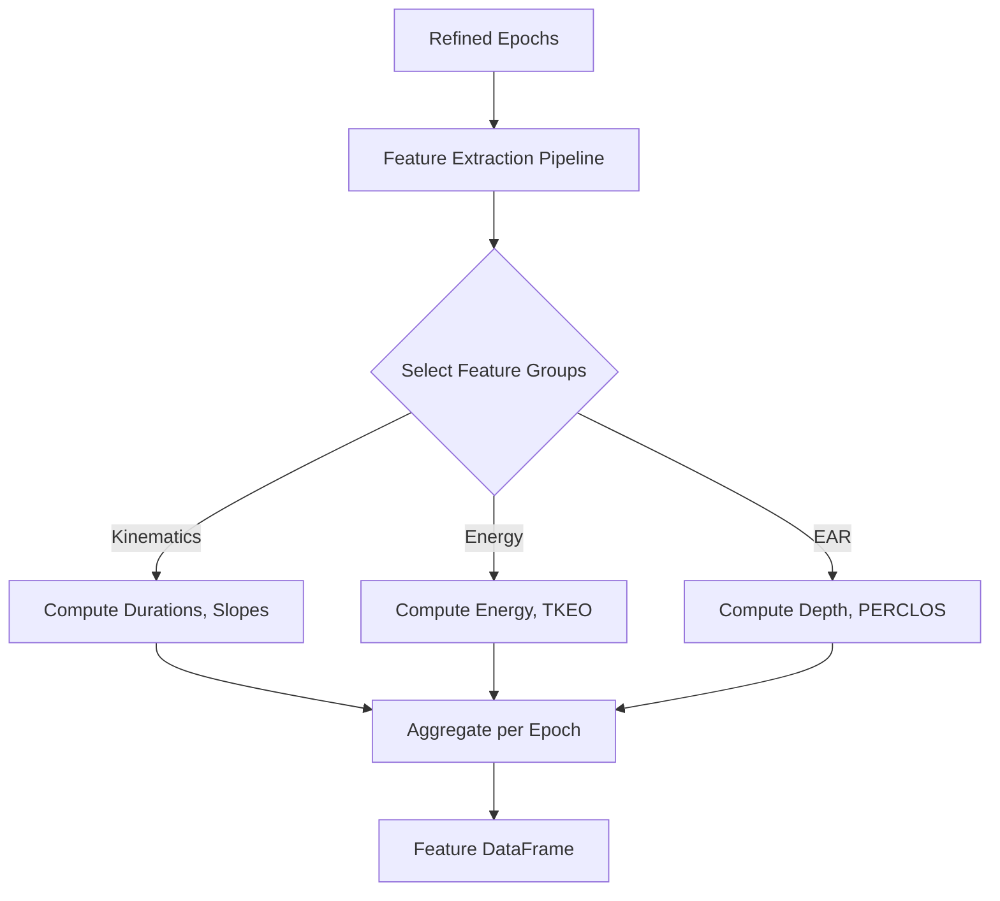

# Blink Metrics and Features

## Purpose
`pyblinker` computes a comprehensive suite of features for every detected blink. These features describe the timing, morphology, kinematics, and energy of the blink event. Features are computed per blink and then aggregated (averaged/summed) per epoch.

## Design Principles
*   **Modularity**: Features are grouped by domain (e.g., "kinematics", "energy"). New feature groups can be added by creating a new module and registering it in the pipeline.
*   **Averaging API**: The pipeline automatically computes summary statistics (mean, std, etc.) for each feature across all blinks in an epoch, facilitating epoch-level analysis.

## Feature Reference

Unless noted otherwise:
- **Time** is measured in **seconds**.
- **Amplitude** is measured in the native units of the input signal (e.g., µV for EEG, unitless ratio for EAR).

### 1. Shared Features (EAR, EEG, EOG)
*Applicable to any detected blink.*

#### A. Blink Event Statistics (per epoch)
*   **`blink_total`**: Count of valid blinks.
*   **`blink_rate`**: Blinks per minute.
*   **`ibi_mean`**, **`ibi_std`**, **`ibi_cv`**: Inter-Blink Interval statistics (alertness/fatigue measures).
*   **`ibi_rmssd`**: Root mean square of successive differences (variability).

#### B. Kinematics & Morphology (per blink)
*   **Duration**: `rise_time`, `fall_time`, `half_width`.
*   **Velocity**: `vel_peak_abs`, `vel_mean_abs`, `slope_rise`, `slope_fall`.
*   **Amplitude**: `amp_peak_abs`, `amp_peak_to_trough`.
*   **Area**: `area_abs_total_trapz`, `symmetry_trapz`.

### 2. EAR-specific Features
*Derived from Eye Aspect Ratio video signals.*

#### A. EAR Blink Metrics
*   **`ear_blink_depth`**: How fully the eye closed.
*   **`closed_duration_seconds`**: Duration where eye was functionally closed.
*   **`auc_below_threshold`**: Area under the closure curve.
*   **`refined_closing_slope`** / **`opening_slope`**: Precise slopes using interpolated crossings.

#### B. Open-Eye State (Baseline)
*   **`perclos`**: Percentage of time eyes are >= 80% closed (drowsiness standard).
*   **`baseline_drift`**: Slope of open-eye signal (detects ptosis/drooping).
*   **`micropause_count`**: Brief drops not classified as full blinks.
*   **`zero_crossing_rate`**: Gaze stability measure.

### 3. EEG/EOG-specific Features
*Derived from voltage signals.*

#### A. Energy & Complexity
*   **`blink_signal_energy`**: Total energy ($\sum x^2$).
*   **`teager_kaiser_energy`**: Emphasizes instantaneous changes (onset detection).
*   **`blink_line_length`**: Waveform complexity/fractal dimension.

#### B. Frequency Domain
*   **`wavelet_energy_d1..d4`** (per modality): Energy in discrete wavelet bands, computed separately for each modality and labeled as ``wavelet_energy_d{level}_{modality}`` (e.g., ``wavelet_energy_d2_ear``, ``wavelet_energy_d3_eeg``). Blinks are typically low-frequency (D3-D4); high-frequency energy (D1) suggests muscle noise.
    *   Implementation: `pyblinker/blink_features/frequency_domain/aggregate.py` computes wavelet energies per channel and then aggregates them by modality without averaging channels together.
    *   Unit tests: `test/blink_features/frequency_domain/test_frequency_domain_blink_features_ear_eeg_eog.py` verifies EAR/EEG/EOG outputs contain modality-specific wavelet energy columns.

*Frequency-domain aggregation change*: Channel selection, missing-channel validation, and sampling-frequency warnings for wavelet aggregation now live in a shared helper to keep the computation path consistent across callers.

*Related Code*:
*   `pyblinker/blink_features/frequency_domain/aggregate.py` (wavelet aggregation entry point)
*   `pyblinker/blink_features/utils/aggregation.py` (channel preparation and validation helper)

*Unit Tests*:
*   `test/blink_features/frequency_domain/test_frequency_domain_blink_features_ear_only.py`
*   `test/blink_features/frequency_domain/test_frequency_domain_blink_features_eeg_only.py`
*   `test/blink_features/frequency_domain/test_frequency_domain_blink_features_eog_only.py`
*   `test/blink_features/frequency_domain/test_frequency_domain_blink_features_ear_eeg_eog.py`

### Flowchart

## Related Code

*   **`pyblinker/pipeline.py`**: Defines `FEATURE_AGGREGATORS` and the `extract_features` function.
*   **`pyblinker/blink_features/`**: Directory containing specific feature implementations:
    *   `_core_blink.py` (Kinematics)
    *   `ear_metrics/` (EAR specific)
    *   `energy/` (Signal energy)
    *   `frequency_domain/` (Wavelets)
    *   `blink_events/` (Rate, IBI)

## Tutorials

*   **`tutorial/05c_minimal_blink_feature_tutorial.py`**:
    A lightweight script showing how to extract a single category of features (e.g., just kinematics). It is useful for integration into pipelines where speed is critical and the full feature set is not required.
*   **`tutorial/05b_eeg_feature_extraction_tutorial.py`**:
    Focuses on EEG/EOG signals, demonstrating features like `blink_signal_energy` and `teager_kaiser_energy` which are specific to voltage time-series analysis.
*   **`tutorial/05a_ear_energy_feature_tutorial.py`**:
    A stage 5 (feature extraction) walkthrough that refines EAR annotations, slices epochs, and calculates energy features on the EAR channel to show how "energy" concepts translate to the unitless aspect ratio signal.
*   **`tutorial/06a_ear_kinematics_feature_tutorial.py`**:
    Demonstrates EAR-only kinematic calculations without requiring EEG channels or placeholder SEGMENT_CONFIG entries.
*   **`tutorial/06b_eeg_kinematics_feature_tutorial.py`**:
    Shows EEG/EOG kinematic aggregation with SEGMENT_CONFIG containing only the voltage modalities that are present.

## Kinematic channel flexibility

*Feature/change*: Kinematic feature extraction now explicitly supports EAR-only, EEG-only, mixed, and partial `SEGMENT_CONFIG` inputs without requiring dummy modality keys. Channel validation is skipped for omitted modalities, while provided channels are still validated strictly.
Automatic modality inference per channel prevents EEG defaults when processing EAR or EOG inputs, ensuring the correct metric variants are applied.

*Related Code*:
*   `pyblinker/segmentation/refinement.py` (modality gating and channel resolution during segmentation)
*   `pyblinker/blink_features/kinematics/kinematic_features.py` (channel selection, modality inference, and aggregation)

*Tutorials*:
*   `tutorial/06a_ear_kinematics_feature_tutorial.py`
*   `tutorial/06b_eeg_kinematics_feature_tutorial.py`

*Unit Tests*:
*   `test/blink_features/kinematics/test_optional_channels_and_configs.py`: Exercises EAR-only, EEG-only, combined, and incomplete `SEGMENT_CONFIG` shapes to ensure channel picking and refinement do not crash when modalities are missing.

## Kinematic epoch data preparation

*Feature/change*: Kinematic feature computation now prepares epoch-level channel data via the shared aggregation helper, using the extractor sampling frequency to mirror the frequency-domain data preparation workflow. This keeps kinematic outputs compatible with the downstream aggregation framework.

*Related Code*:
*   `pyblinker/blink_features/kinematics/kinematic_features.py` (shared epoch/channel data preparation within `KinematicBlinkFeatureExtractor`)
*   `pyblinker/blink_features/utils/aggregation.py` (common `prepare_epoch_channel_data` helper)

*Unit Tests*:
*   `test/blink_features/kinematics/test_kinematic_features.py`: Validates the per-blink kinematic metrics after refactoring the epoch/channel preparation.

## Kinematic style-aware metadata and naming

*Feature/change*: Kinematic aggregation now prepares per-channel waveform, first-derivative, and second-derivative data for each epoch and reads modality/style-specific onset and duration keys (e.g., `onset__th_interpolation__ear`, `duration__outer__eeg`). Columns are emitted using the pattern `<modality>__<style>__kinematic__<metric>__<channel>` (with statistics appended), aligning the kinematic schema with other feature families.

*Related Code*:
*   `pyblinker/blink_features/utils/aggregation.py` (per-channel `raw`, `dx1`, `dx2` arrays in `prepare_epoch_channel_data`)
*   `pyblinker/blink_features/kinematics/kinematic_features.py` (style-aware window selection and feature naming)
*   `pyblinker/segmentation/refinement/ear/epoch.py` (propagating EAR threshold-interpolation onset/duration metadata for style-specific windows)

*Unit Tests*:
*   `test/blink_features/kinematics/test_kinematic_features.py`: Verifies style-aware kinematic outputs and statistics.
*   `test/blink_features/kinematics/test_optional_channels_and_configs.py`: Confirms channel-specific column naming across modality combinations.

## Unit Tests

*   **`test/run_all_features_test.py`**:
    The master runner for the feature subsystem. It ensures that *all* feature aggregators (kinematics, energy, etc.) can run together on a standard dataset without conflict.
*   **`test/blink_features/kinematics/test_kinematic_features.py`**:
    Validates formulas for velocity, acceleration, and slope. It likely uses simple geometric shapes (triangles, bells) where the derivative is known to verify the code's accuracy.
*   **`test/blink_features/kinematics/test_optional_channels_and_configs.py`**:
    Confirms kinematic aggregation accepts EAR-only, EEG-only, mixed, and partial `SEGMENT_CONFIG` inputs without placeholder channels.
*   **`test/blink_features/kinematics/test_kinematics_ear_only_config.py`**:
    Scenario A coverage for EAR-only refinement and feature aggregation without EEG keys or placeholders.
*   **`test/blink_features/kinematics/test_kinematics_eeg_only_config.py`**:
    Scenario B coverage showing EEG (with optional EOG) can run without EAR configuration.
*   **`test/blink_features/kinematics/test_kinematics_eog_only_config.py`**:
    EOG-only segmentation and aggregation to confirm the modality runs independently.
*   **`test/blink_features/kinematics/test_kinematics_ear_eeg_eog.py`**:
    Full EAR+EEG+EOG config ensures all modalities remain supported together.
*   **`test/blink_features/kinematics/test_kinematics_incomplete_config.py`**:
    Scenario D coverage demonstrating omitted modality keys do not block processing of configured channels.
*   **`test/blink_features/energy/test_energy_features.py`**:
    Tests the calculation of signal energy and TKEO.
*   **`test/blink_features/blink_events/test_inter_blink_interval.py`**:
    Checks the statistics of blink timing (IBI). Crucially, it verifies that the code correctly handles epochs with *zero* or *one* blink (where IBI is undefined).
*   **Frequency-domain blink feature tests**:
    *   `test/blink_features/frequency_domain/test_frequency_domain_blink_features_ear_only.py`
    *   `test/blink_features/frequency_domain/test_frequency_domain_blink_features_eeg_only.py`
    *   `test/blink_features/frequency_domain/test_frequency_domain_blink_features_eog_only.py`
    *   `test/blink_features/frequency_domain/test_frequency_domain_blink_features_ear_eeg_eog.py`
    These validate the Wavelet decomposition (D1-D4 bands) across EAR, EEG, EOG, and combined modalities, ensuring the correct wavelet family (`db4`) is used and that the energy summation is correct. The EEG-only suite also checks that channel-level energies are aggregated per modality rather than averaging signals across channels.
*   **`test/blink_features/open_eye/test_open_eye_features.py`**:
    Tests features derived from the "non-blink" periods, such as PERCLOS (percentage of time eyes are closed) and baseline drift.
