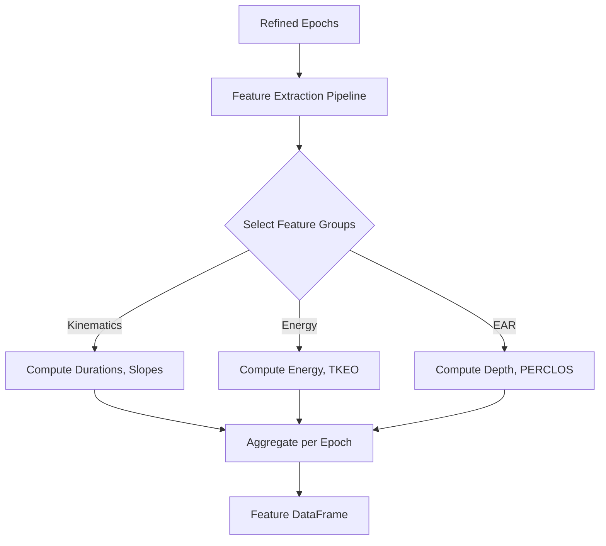

# Blink Metrics and Features

## Purpose
`pyblinker` computes a comprehensive suite of features for every detected blink. These features describe the timing, morphology, kinematics, and energy of the blink event. Features are computed per blink and then aggregated (averaged/summed) per epoch.

## Design Principles
*   **Modularity**: Features are grouped by domain (e.g., "kinematics", "energy"). New feature groups can be added by creating a new module and registering it in the pipeline.
*   **Averaging API**: The pipeline automatically computes summary statistics (mean, std, etc.) for each feature across all blinks in an epoch, facilitating epoch-level analysis.

## Feature Reference

Unless noted otherwise:
- **Time** is measured in **seconds**.
- **Amplitude** is measured in the native units of the input signal (e.g., µV for EEG, unitless ratio for EAR).

### 1. Shared Features (EAR, EEG, EOG)
*Applicable to any detected blink.*

#### A. Blink Event Statistics (per epoch)
*   **`blink_total`**: Count of valid blinks.
*   **`blink_rate`**: Blinks per minute.
*   **`ibi_mean`**, **`ibi_std`**, **`ibi_cv`**: Inter-Blink Interval statistics (alertness/fatigue measures).
*   **`ibi_rmssd`**: Root mean square of successive differences (variability).

#### B. Kinematics & Morphology (per blink)
*   **Duration**: `rise_time`, `fall_time`, `half_width`.
*   **Velocity**: `vel_peak_abs`, `vel_mean_abs`, `slope_rise`, `slope_fall`.
*   **Amplitude**: `amp_peak_abs`, `amp_peak_to_trough`.
*   **Area**: `area_abs_total_trapz`, `symmetry_trapz`.
*   **Blink ratios & timing**: `amp_vel_ratio_base`, `amp_vel_ratio_tent`, `amp_vel_ratio_zero_to_max`, `blink_velocity`, `inter_blink_max_vel`.

### 2. EAR-specific Features
*Derived from Eye Aspect Ratio video signals.*

#### A. EAR Blink Metrics
*   **`ear_blink_depth`**: How fully the eye closed.
*   **`closed_duration_seconds`**: Duration where eye was functionally closed.
*   **`auc_below_threshold`**: Area under the closure curve.
*   **`refined_closing_slope`** / **`opening_slope`**: Precise slopes using interpolated crossings.

#### B. Open-Eye State (Baseline)
*   **`perclos`**: Percentage of time eyes are >= 80% closed (drowsiness standard).
*   **`baseline_drift`**: Slope of open-eye signal (detects ptosis/drooping).
*   **`micropause_count`**: Brief drops not classified as full blinks.
*   **`zero_crossing_rate`**: Gaze stability measure.

### 3. EEG/EOG-specific Features
*Derived from voltage signals.*

#### A. Energy & Complexity
*   **`blink_signal_energy`**: Total energy ($\sum x^2$).
*   **`teager_kaiser_energy`**: Emphasizes instantaneous changes (onset detection).
*   **`blink_line_length`**: Waveform complexity/fractal dimension.

#### B. Frequency Domain
*   **`wavelet_energy_d1..d4`** (per modality): Energy in discrete wavelet bands, computed separately for each modality and labeled as ``wavelet_energy_d{level}_{modality}`` (e.g., ``wavelet_energy_d2_ear``, ``wavelet_energy_d3_eeg``). Blinks are typically low-frequency (D3-D4); high-frequency energy (D1) suggests muscle noise.
    *   Implementation: `pyblinker/blink_features/frequency_domain/aggregate.py` computes wavelet energies per channel and then aggregates them by modality without averaging channels together.
    *   Unit tests: `test/blink_features/frequency_domain/test_frequency_domain_blink_features_ear_eeg_eog.py` verifies EAR/EEG/EOG outputs contain modality-specific wavelet energy columns.

*Frequency-domain aggregation change*: Channel selection, missing-channel validation, and sampling-frequency warnings for wavelet aggregation now live in a shared helper to keep the computation path consistent across callers.

#### MATLAB parity definitions for BlinkProperties
Below are the feature definitions from the BLINKER paper and the MATLAB reference, mapped to Python column names. In MATLAB output tables, columns use **camelCase** (e.g., `durationBase`), while the Python outputs use **snake_case** (e.g., `duration_base`). The comparison tests map MATLAB to Python via these names when validating parity.

**Landmark definitions (paper terminology)**
* **`leftZero`**: last zero crossing before `maxFrame`. If the signal does not cross zero between this blink and the previous blink, `leftZero` is the frame of lowest amplitude between blinks.
* **`rightZero`**: first zero crossing after `maxFrame`.
* **`upStroke`**: interval between `leftZero` and `maxFrame`.
* **`downStroke`**: interval between `maxFrame` and `rightZero`.
* **`leftBase`**: first local minimum to the left of the maximum velocity frame in the upStroke.
* **`rightBase`**: first local minimum to the right of the maximum velocity frame in the downStroke.

**Blink property column mapping and calculations**
Each entry lists the Python column, the MATLAB column, a concise definition, and the function that computes it.

* **`duration_base`** ↔ `durationBase`: `(rightBase - leftBase) / srate` (seconds). Implemented in `pyblinker/blink_features/morphology/core_metrics.py:compute_blink_durations`.
* **`duration_zero`** ↔ `durationZero`: `(rightZero - leftZero) / srate` (seconds). Implemented in `pyblinker/blink_features/morphology/core_metrics.py:compute_blink_durations`.
* **`duration_tent`** ↔ `durationTent`: `(rightXIntercept - leftXIntercept) / srate` (seconds). Implemented in `pyblinker/blink_features/morphology/core_metrics.py:compute_blink_durations`.
* **`duration_half_base`** ↔ `durationHalfBase`: `(rightBaseHalfHeight - leftBaseHalfHeight + 1) / srate` (seconds). Implemented in `pyblinker/blink_features/morphology/core_metrics.py:compute_blink_durations`.
* **`duration_half_zero`** ↔ `durationHalfZero`: `(rightZeroHalfHeight - leftZeroHalfHeight + 1) / srate` (seconds). Implemented in `pyblinker/blink_features/morphology/core_metrics.py:compute_blink_durations`.
* **`inter_blink_max_amp`** ↔ `interBlinkMaxAmp`: `(next maxFrame - maxFrame) / srate` (seconds) for the next blink; last blink is `NaN`. Implemented in `pyblinker/blink_features/morphology/core_metrics.py:compute_blink_peak_times`.
* **`inter_blink_max_vel_base`** ↔ `interBlinkMaxVelBase`: `(-peaks_pos_vel_base) / srate` (seconds), referencing the maximum upstroke velocity frame; last blink is `NaN`. Implemented in `pyblinker/blink_features/kinematics/core_metrics.py:compute_inter_blink_max_vel`.
* **`inter_blink_max_vel_zero`** ↔ `interBlinkMaxVelZero`: `(-peaks_pos_vel_zero) / srate` (seconds), referencing the maximum upstroke velocity frame; last blink is `NaN`. Implemented in `pyblinker/blink_features/kinematics/core_metrics.py:compute_inter_blink_max_vel`.
* **`neg_amp_vel_ratio_base`** ↔ `negAmpVelRatioBase`: `100 * abs(maxValue / min(velocity in maxFrame:rightBase)) / srate`. Implemented in `pyblinker/blink_features/kinematics/core_metrics.py:compute_amp_vel_ratio_base`.
* **`pos_amp_vel_ratio_base`** ↔ `posAmpVelRatioBase`: `100 * abs(maxValue / max(velocity in leftBase:maxFrame)) / srate`. Implemented in `pyblinker/blink_features/kinematics/core_metrics.py:compute_amp_vel_ratio_base`.
* **`neg_amp_vel_ratio_zero`** ↔ `negAmpVelRatioZero`: `100 * abs(maxValue / min(velocity in maxFrame:rightZero)) / srate`. Implemented in `pyblinker/blink_features/kinematics/core_metrics.py:compute_amp_vel_ratio_zero_to_max`.
* **`pos_amp_vel_ratio_zero`** ↔ `posAmpVelRatioZero`: `100 * abs(maxValue / max(velocity in leftZero:maxFrame)) / srate`. Implemented in `pyblinker/blink_features/kinematics/core_metrics.py:compute_amp_vel_ratio_zero_to_max`.
* **`neg_amp_vel_ratio_tent`** ↔ `negAmpVelRatioTent`: `100 * abs(maxValue / averRightVelocity) / srate`. Implemented in `pyblinker/blink_features/kinematics/core_metrics.py:compute_amp_vel_ratio_tent`.
* **`pos_amp_vel_ratio_tent`** ↔ `posAmpVelRatioTent`: `100 * abs(maxValue / averLeftVelocity) / srate`. Implemented in `pyblinker/blink_features/kinematics/core_metrics.py:compute_amp_vel_ratio_tent`.
* **`time_shut_base`** ↔ `timeShutBase`: duration above `shutAmpFraction * maxValue` between `leftBase` and `rightBase`. Implemented in `pyblinker/blink_features/morphology/core_metrics.py:compute_time_base_shut`.
* **`time_shut_zero`** ↔ `timeShutZero`: duration above `shutAmpFraction * maxValue` between `leftZero` and `rightZero`. Implemented in `pyblinker/blink_features/morphology/core_metrics.py:compute_time_zero_shut`.
* **`time_shut_tent`** ↔ `timeShutTent`: duration above `shutAmpFraction * maxValue` between `leftXIntercept` and `rightXIntercept`. Implemented in `pyblinker/blink_features/morphology/core_metrics.py:compute_time_base_shut`.
* **`closing_time_zero`** ↔ `closingTimeZero`: `(maxFrame - leftZero) / srate`. Implemented in `pyblinker/blink_features/morphology/core_metrics.py:compute_time_zero_shut`.
* **`reopening_time_zero`** ↔ `reopeningTimeZero`: `(rightZero - maxFrame) / srate`. Implemented in `pyblinker/blink_features/morphology/core_metrics.py:compute_time_zero_shut`.
* **`closing_time_tent`** ↔ `closingTimeTent`: `(xIntersect - leftXIntercept) / srate`. Implemented in `pyblinker/blink_features/morphology/core_metrics.py:compute_time_base_shut`.
* **`reopening_time_tent`** ↔ `reopeningTimeTent`: `(rightXIntercept - xIntersect) / srate`. Implemented in `pyblinker/blink_features/morphology/core_metrics.py:compute_time_base_shut`.
* **`peak_time_blink`** ↔ `peakTimeBlink`: `(maxFrame + 1) / srate` (MATLAB 1-based frame). Implemented in `pyblinker/blink_features/morphology/core_metrics.py:compute_blink_peak_times`.
* **`peak_time_tent`** ↔ `peakTimeTent`: `(xIntersect + 1) / srate` (MATLAB 1-based frame). Implemented in `pyblinker/blink_features/morphology/core_metrics.py:compute_blink_peak_times`.
* **`peak_max_blink`** ↔ `peakMaxBlink`: `maxValue` (blink peak amplitude). Implemented in `pyblinker/blink_features/morphology/core_metrics.py:compute_blink_peak_times`.
* **`peak_max_tent`** ↔ `peakMaxTent`: `yIntersect` (tent-fit peak amplitude). Implemented in `pyblinker/blink_features/morphology/core_metrics.py:compute_blink_peak_times`.

*Related Code*:
*   `pyblinker/blink_features/frequency_domain/aggregate.py` (wavelet aggregation entry point)
*   `pyblinker/blink_features/utils/aggregation.py` (channel preparation and validation helper)

*Unit Tests*:
*   `test/blink_features/frequency_domain/test_frequency_domain_blink_features_ear_only.py`
*   `test/blink_features/frequency_domain/test_frequency_domain_blink_features_eeg_only.py`
*   `test/blink_features/frequency_domain/test_frequency_domain_blink_features_eog_only.py`
*   `test/blink_features/frequency_domain/test_frequency_domain_blink_features_ear_eeg_eog.py`

### Flowchart

## Related Code

*   **`pyblinker/pipeline.py`**: Defines `FEATURE_AGGREGATORS` and the `extract_features` function.
*   **`pyblinker/blink_features/`**: Directory containing specific feature implementations:
    *   `_core_blink.py` (legacy shared blink core wrapper)
    *   `ear_metrics/` (EAR specific)
    *   `energy/` (Signal energy)
    *   `frequency_domain/` (Wavelets)
    *   `blink_events/` (Rate, IBI)

## Tutorials

*   **`tutorial/05c_minimal_blink_feature_tutorial.py`**:
    A lightweight script showing how to extract a single category of features (e.g., just kinematics). It is useful for integration into pipelines where speed is critical and the full feature set is not required.
*   **`tutorial/05b_eeg_feature_extraction_tutorial.py`**:
    Focuses on EEG/EOG signals, demonstrating features like `blink_signal_energy` and `teager_kaiser_energy` which are specific to voltage time-series analysis.
*   **`tutorial/05a_ear_energy_feature_tutorial.py`**:
    A stage 5 (feature extraction) walkthrough that refines EAR annotations, slices epochs, and calculates energy features on the EAR channel to show how "energy" concepts translate to the unitless aspect ratio signal.
*   **`tutorial/06a_ear_kinematics_feature_tutorial.py`**:
    Demonstrates EAR-only kinematic calculations without requiring EEG channels or placeholder SEGMENT_CONFIG entries.
*   **`tutorial/06b_eeg_kinematics_feature_tutorial.py`**:
    Shows EEG/EOG kinematic aggregation with SEGMENT_CONFIG containing only the voltage modalities that are present.

## Kinematic channel flexibility

*Feature/change*: Kinematic feature extraction now explicitly supports EAR-only, EEG-only, mixed, and partial `SEGMENT_CONFIG` inputs without requiring dummy modality keys. Channel validation is skipped for omitted modalities, while provided channels are still validated strictly.
Automatic modality inference per channel prevents EEG defaults when processing EAR or EOG inputs, ensuring the correct metric variants are applied.

*Related Code*:
*   `pyblinker/segmentation/refinement.py` (modality gating and channel resolution during segmentation)
*   `pyblinker/blink_features/kinematics/kinematic_features.py` (channel selection, modality inference, and aggregation)

*Tutorials*:
*   `tutorial/06a_ear_kinematics_feature_tutorial.py`
*   `tutorial/06b_eeg_kinematics_feature_tutorial.py`

*Unit Tests*:
*   `test/blink_features/kinematics/test_optional_channels_and_configs.py`: Exercises EAR-only, EEG-only, combined, and incomplete `SEGMENT_CONFIG` shapes to ensure channel picking and refinement do not crash when modalities are missing.

## Kinematic extractor import path cleanup

*Feature/change*: Kinematic feature tests and tutorials now import the extractor or wrapper directly from `kinematic_features.py` to avoid relying on package-level lazy exports. This keeps imports explicit and consistent with the recommended usage pattern.

*Related Code*:
*   `pyblinker/blink_features/kinematics/kinematic_features.py` (extractor and wrapper implementation)
*   `pyblinker/blink_features/kinematics/__init__.py` (minimal module surface)

*Tutorials*:
*   `tutorial/06a_ear_kinematics_feature_tutorial.py`
*   `tutorial/06b_eeg_kinematics_feature_tutorial.py`

*Unit Tests*:
*   `test/blink_features/kinematics/test_kinematic_features.py`
*   `test/blink_features/kinematics/test_kinematics_ear_only_config.py`
*   `test/blink_features/kinematics/test_kinematics_eeg_only_config.py`
*   `test/blink_features/kinematics/test_kinematics_eog_only_config.py`
*   `test/blink_features/kinematics/test_kinematics_ear_eeg_eog.py`

## EAR-only kinematic epoch routing and style discovery

*Feature/change*: The kinematic epoch extractor now supports EAR-only inputs produced by `extractor.compute(picks=EAR_CHANNEL)` by resolving non-EEG segmentation styles from metadata (`start__<style>__ear`/`end__<style>__ear`) and reusing the same 1D per-channel kinematic computation path used in EEG mode. EEG channel behavior and style semantics remain unchanged.

*Related Code*:
*   `pyblinker/blink_features/kinematics/kinematic_features.py` (generic style discovery, EAR window extraction, and compatibility aliases for legacy EAR interpolation column names)

*Tutorials*:
*   `tutorial/06a_ear_kinematics_feature_tutorial.py`
*   `tutorial/06b_eeg_kinematics_feature_tutorial.py`

*Unit Tests*:
*   `test/blink_features/kinematics/test_kinematics_ear_only_config.py`: validates EAR-only extraction and expected output columns.
*   `test/blink_features/kinematics/test_kinematics_eeg_only_config.py`: validates unchanged EEG-only output behavior.
*   `test/blink_features/morphology/test_epoch_morphology_features_aggregation.py`: validates cross-family epoch aggregation compatibility after the kinematic refactor.

## Morphology and kinematics metric split

*Feature/change*: Blink waveform analytics are now split into morphology-only and kinematic-only pipelines. Morphology metrics (area, symmetry, rise/fall timing, widths, amplitudes, and EAR baseline handling) are computed separately from kinematic metrics (velocity, acceleration, and slope), preventing cross-domain outputs when a pipeline only needs one family.

*Related Code*:
*   `pyblinker/blink_features/morphology/core_metrics.py` (morphology-only blink metrics)
*   `pyblinker/blink_features/kinematics/core_metrics.py` (kinematic-only blink metrics)
*   `pyblinker/blink_features/morphology/per_blink.py` (morphology per-blink entry point)
*   `pyblinker/blink_features/kinematics/per_blink.py` (kinematic per-blink entry point)

*Tutorials*:
*   `tutorial/05c_minimal_blink_feature_tutorial.py`: Shows how to request a single feature family (e.g., kinematics only).
*   `tutorial/06a_ear_kinematics_feature_tutorial.py`: Demonstrates kinematic-only extraction for EAR signals.

*Unit Tests*:
*   `test/blink_features/kinematics/test_kinematics_eeg_only_config.py`: Ensures kinematic metrics run without morphology outputs for EEG-only configs.
*   `test/blink_features/morphology/test_epoch_morphology_features_aggregation.py`: Validates morphology-only aggregation paths after the split.

## BlinkProperties refactor into kinematics/morphology cores

*Feature/change*: The BlinkProperties feature calculations (durations, shut times, amplitude-velocity ratios, and inter-blink timing) are now implemented in the kinematics and morphology core metric modules. BlinkProperties itself delegates to these core functions so the legacy API and output schema remain stable while the authoritative math lives in the dedicated feature domains.
The core helpers are structured to compute metrics one blink at a time so per-blink workflows (including `per_blink` entry points) remain supported without relying on vectorized DataFrame-wide calculations.

*Related Code*:
*   `pyblinker/blink_features/kinematics/core_metrics.py` (amplitude-velocity ratios and inter-blink velocity timing)
*   `pyblinker/blink_features/morphology/core_metrics.py` (durations, shut-time metrics, and peak/inter-blink timing)
*   `pyblinker/blink_features/waveform_features/extract_blink_properties.py` (BlinkProperties delegating to core metrics)
*   `pyblinker/pipeline_steps.py` (pipeline step uses the refactored core metrics)

*Tutorials*:
*   `tutorial/01a_basic_usage.py`
*   `tutorial/verify_blink_properties_consistency.py`

*Unit Tests*:
*   `test/blink_features/pyblinker/test_blink_properties.py`
*   `test/blinker_migration/test_step2_computeBlinkProperties.py`
*   `test/blink_features/kinematics/test_kinematic_features.py`
*   `test/blink_features/kinematics/test_kinematics_ear_only_config.py`
*   `test/blink_features/kinematics/test_kinematics_eeg_only_config.py`
*   `test/blink_features/kinematics/test_kinematics_eog_only_config.py`
*   `test/blink_features/kinematics/test_kinematics_ear_eeg_eog.py`

## Kinematic epoch data preparation

*Feature/change*: Kinematic feature computation now prepares epoch-level channel data via the shared aggregation helper, using the extractor sampling frequency to mirror the frequency-domain data preparation workflow. This keeps kinematic outputs compatible with the downstream aggregation framework.

*Related Code*:
*   `pyblinker/blink_features/kinematics/kinematic_features.py` (shared epoch/channel data preparation within `KinematicBlinkFeatureExtractor`)
*   `pyblinker/blink_features/utils/aggregation.py` (common `prepare_epoch_channel_data` helper)

*Unit Tests*:
*   `test/blink_features/kinematics/test_kinematic_features.py`: Validates the per-blink kinematic metrics after refactoring the epoch/channel preparation.

## Kinematic style-aware metadata and naming

*Feature/change*: Kinematic aggregation now prepares per-channel waveform, first-derivative, and second-derivative data for each epoch and reads modality/style-specific frame landmark bounds (e.g., `start__left_base__ear`, `end__right_base__eeg`). Columns are emitted using the pattern `<modality>__<style>__kinematic__<metric>__<channel>` (with statistics appended), aligning the kinematic schema with other feature families.

*Related Code*:
*   `pyblinker/blink_features/utils/aggregation.py` (per-channel `raw`, `dx1`, `dx2` arrays in `prepare_epoch_channel_data`)
*   `pyblinker/blink_features/kinematics/kinematic_features.py` (style-aware window selection and feature naming with derivative reuse)
*   `pyblinker/segmentation/refinement/ear/epoch.py` (propagating EAR threshold-interpolation and refined onset/duration metadata for style-specific windows)

*Unit Tests*:
*   `test/blink_features/kinematics/test_kinematic_features.py`: Verifies style-aware kinematic outputs and statistics.
*   `test/blink_features/kinematics/test_optional_channels_and_configs.py`: Confirms channel-specific column naming across modality combinations.

## Kinematic frame-window slicing and helper refactor

*Feature/change*: Kinematic epoch aggregation now slices blink segments directly from frame-based start/end metadata and refactors extended legacy kinematic metric computation into dedicated helper functions for readability and debugging.

*Related Code*:
*   `pyblinker/blink_features/kinematics/kinematic_features.py` (frame-window extraction, helperized legacy kinematic calculations, and epoch-level segment slicing)

*Tutorials*:
*   None (internal refactor and window-source update; existing kinematic tutorials remain valid).

*Unit Tests*:
*   `test/blink_features/kinematics/test_kinematic_features.py`: Verifies frame-based style window extraction and manual per-window metric aggregation parity.

## Morphology epoch extractor refactor

*Feature/change*: Morphology epoch aggregation now mirrors the kinematic extractor lifecycle, using class-based computation, modality-aware column naming, and deterministic column ordering. Output columns follow `<modality>__<style>__morphology__<metric>_<stat>__<channel>` with a base-only style.

*Related Code*:
*   `pyblinker/blink_features/morphology/epoch_features.py` (class-based morphology aggregation and wrapper)
*   `pyblinker/blink_features/utils/aggregation.py` (shared epoch/channel preparation helper)

*Tutorials*:
*   None (refactor only; no new tutorial added).

*Unit Tests*:
*   `test/blink_features/morphology/test_epoch_morphology_features.py`
*   `test/blink_features/morphology/test_epoch_morphology_features_aggregation.py`

## Morphology epoch naming alignment and legacy metrics

*Feature/change*: Morphology epoch extraction now computes duration, shut-time, and inter-blink timing values via the shared core metrics and emits both legacy flat names (e.g., `duration_base`, `closing_time_zero`) and fully-qualified morphology columns (e.g., `eeg__base__morphology__duration_mean__EEG-E8`). This keeps legacy tutorials consistent while aligning with the newer style-aware column convention. The extractor is structured into small helper methods with debug logging to make epoch/modality/channel/style troubleshooting easier.

*Related Code*:
*   `pyblinker/blink_features/morphology/epoch_features.py` (epoch-level aggregation, legacy column aliases, and duration stats)
*   `pyblinker/blink_features/morphology/core_metrics.py` (single-source duration and time-shut calculations)
*   `pyblinker/blink_features/morphology/__init__.py` (explicit exports for public API)

*Tutorials*:
*   `tutorial/01a_basic_usage.py`
*   `tutorial/verify_blink_properties_consistency.py`

*Unit Tests*:
*   `test/blink_features/morphology/test_morphology/_eeg_only_config.py`
*   `test/blink_features/morphology/test_epoch_morphology_features_aggregation.py`

## Unit Tests

*   **`test/run_all_features_test.py`**:
    The master runner for the feature subsystem. It ensures that *all* feature aggregators (kinematics, energy, etc.) can run together on a standard dataset without conflict.
*   **`test/blink_features/kinematics/test_kinematic_features.py`**:
    Validates formulas for velocity, acceleration, and slope. It likely uses simple geometric shapes (triangles, bells) where the derivative is known to verify the code's accuracy.
*   **`test/blink_features/kinematics/test_optional_channels_and_configs.py`**:
    Confirms kinematic aggregation accepts EAR-only, EEG-only, mixed, and partial `SEGMENT_CONFIG` inputs without placeholder channels.
*   **`test/blink_features/kinematics/test_kinematics_ear_only_config.py`**:
    Scenario A coverage for EAR-only refinement and feature aggregation without EEG keys or placeholders.
*   **`test/blink_features/kinematics/test_kinematics_eeg_only_config.py`**:
    Scenario B coverage showing EEG (with optional EOG) can run without EAR configuration.
*   **`test/blink_features/kinematics/test_kinematics_eog_only_config.py`**:
    EOG-only segmentation and aggregation to confirm the modality runs independently.
*   **`test/blink_features/kinematics/test_kinematics_ear_eeg_eog.py`**:
    Full EAR+EEG+EOG config ensures all modalities remain supported together.
*   **`test/blink_features/kinematics/test_kinematics_incomplete_config.py`**:
    Scenario D coverage demonstrating omitted modality keys do not block processing of configured channels.
*   **`test/blink_features/energy/test_energy_features.py`**:
    Tests the calculation of signal energy and TKEO.
*   **`test/blink_features/blink_events/test_inter_blink_interval.py`**:
    Checks the statistics of blink timing (IBI). Crucially, it verifies that the code correctly handles epochs with *zero* or *one* blink (where IBI is undefined).
*   **Frequency-domain blink feature tests**:
    *   `test/blink_features/frequency_domain/test_frequency_domain_blink_features_ear_only.py`
    *   `test/blink_features/frequency_domain/test_frequency_domain_blink_features_eeg_only.py`
    *   `test/blink_features/frequency_domain/test_frequency_domain_blink_features_eog_only.py`
    *   `test/blink_features/frequency_domain/test_frequency_domain_blink_features_ear_eeg_eog.py`
    These validate the Wavelet decomposition (D1-D4 bands) across EAR, EEG, EOG, and combined modalities, ensuring the correct wavelet family (`db4`) is used and that the energy summation is correct. The EEG-only suite also checks that channel-level energies are aggregated per modality rather than averaging signals across channels.
*   **`test/blink_features/open_eye/test_open_eye_features.py`**:
    Tests features derived from the "non-blink" periods, such as PERCLOS (percentage of time eyes are closed) and baseline drift.

## Morphology legacy aggregation: mean/std/cv and new naming

*Feature/change*: The epoch morphology pipeline now keeps legacy per-blink morphology computations unchanged, but expands epoch-level legacy aggregation from mean-only to `mean`, `std`, and `cv` using the shared `_safe_stats` conventions. Legacy aggregated outputs are emitted with the new morphology naming scheme (`{modality}__{style}__morphology__{metric}_{stat}__{channel}`), and the extractor raises a targeted runtime warning when required legacy columns are missing from `blink_df` so `_REQUIRED_LEGACY_MORPHOLOGY_METRICS` mismatches are easier to diagnose.

*Related Code*:
*   `pyblinker/blink_features/morphology/epoch_features.py`
*   `pyblinker/blink_features/energy/helpers.py`

*Tutorials*:
*   `tutorial/verify_blink_properties_consistency.py` (closest existing parity-oriented walkthrough; no new tutorial added).

*Unit Tests*:
*   `test/blink_features/morphology/test_morphology_eeg_only_config.py`
*   `test/blink_features/morphology/test_morphology_eog_only_config.py`
*   `test/blink_features/morphology/test_morphology_ear_eeg_eog.py`
