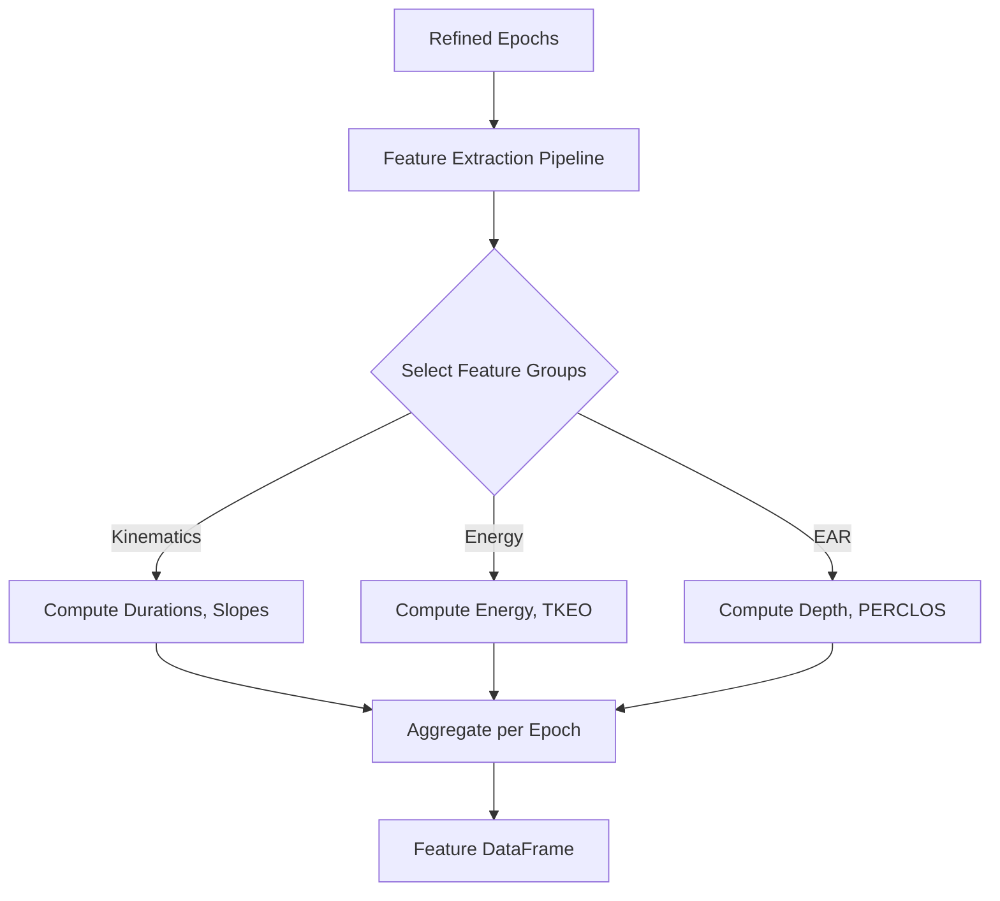

# Blink Metrics and Features

## Purpose
`pyblinker` computes a comprehensive suite of features for every detected blink. These features describe the timing, morphology, kinematics, and energy of the blink event. Features are computed per blink and then aggregated (averaged/summed) per epoch.

## Design Principles
*   **Modularity**: Features are grouped by domain (e.g., "kinematics", "energy"). New feature groups can be added by creating a new module and registering it in the pipeline.
*   **Averaging API**: The pipeline automatically computes summary statistics (mean, std, etc.) for each feature across all blinks in an epoch, facilitating epoch-level analysis.

## Feature Reference

Unless noted otherwise:
- **Time** is measured in **seconds**.
- **Amplitude** is measured in the native units of the input signal (e.g., µV for EEG, unitless ratio for EAR).

### 1. Shared Features (EAR, EEG, EOG)
*Applicable to any detected blink.*

#### A. Blink Event Statistics (per epoch)
*   **`blink_total`**: Count of valid blinks.
*   **`blink_rate`**: Blinks per minute.
*   **`ibi_mean`**, **`ibi_std`**, **`ibi_cv`**: Inter-Blink Interval statistics (alertness/fatigue measures).
*   **`ibi_rmssd`**: Root mean square of successive differences (variability).

#### B. Kinematics & Morphology (per blink)
*   **Duration**: `rise_time`, `fall_time`, `half_width`.
*   **Velocity**: `vel_peak_abs`, `vel_mean_abs`, `slope_rise`, `slope_fall`.
*   **Amplitude**: `amp_peak_abs`, `amp_peak_to_trough`.
*   **Area**: `area_abs_total_trapz`, `symmetry_trapz`.

### 2. EAR-specific Features
*Derived from Eye Aspect Ratio video signals.*

#### A. EAR Blink Metrics
*   **`ear_blink_depth`**: How fully the eye closed.
*   **`closed_duration_seconds`**: Duration where eye was functionally closed.
*   **`auc_below_threshold`**: Area under the closure curve.
*   **`refined_closing_slope`** / **`opening_slope`**: Precise slopes using interpolated crossings.

#### B. Open-Eye State (Baseline)
*   **`perclos`**: Percentage of time eyes are >= 80% closed (drowsiness standard).
*   **`baseline_drift`**: Slope of open-eye signal (detects ptosis/drooping).
*   **`micropause_count`**: Brief drops not classified as full blinks.
*   **`zero_crossing_rate`**: Gaze stability measure.

### 3. EEG/EOG-specific Features
*Derived from voltage signals.*

#### A. Energy & Complexity
*   **`blink_signal_energy`**: Total energy ($\sum x^2$).
*   **`teager_kaiser_energy`**: Emphasizes instantaneous changes (onset detection).
*   **`blink_line_length`**: Waveform complexity/fractal dimension.

#### B. Frequency Domain
*   **`wavelet_energy_d1..d4`**: Energy in discrete wavelet bands. Blinks are typically low-frequency (D3-D4); high-frequency energy (D1) suggests muscle noise.

### Flowchart

## Related Code

*   **`pyblinker/pipeline.py`**: Defines `FEATURE_AGGREGATORS` and the `extract_features` function.
*   **`pyblinker/blink_features/`**: Directory containing specific feature implementations:
    *   `_core_blink.py` (Kinematics)
    *   `ear_metrics/` (EAR specific)
    *   `energy/` (Signal energy)
    *   `frequency_domain/` (Wavelets)
    *   `blink_events/` (Rate, IBI)

## Tutorials

*   **`tutorial/05c_minimal_blink_feature_tutorial.py`**:
    A lightweight script showing how to extract a single category of features (e.g., just kinematics). It is useful for integration into pipelines where speed is critical and the full feature set is not required.
*   **`tutorial/05b_eeg_feature_extraction_tutorial.py`**:
    Focuses on EEG/EOG signals, demonstrating features like `blink_signal_energy` and `teager_kaiser_energy` which are specific to voltage time-series analysis.
*   **`tutorial/05a_ear_energy_feature_tutorial.py`**:
    A stage 5 (feature extraction) walkthrough that refines EAR annotations, slices epochs, and calculates energy features on the EAR channel to show how "energy" concepts translate to the unitless aspect ratio signal.

## Unit Tests

*   **`test/run_all_features_test.py`**:
    The master runner for the feature subsystem. It ensures that *all* feature aggregators (kinematics, energy, etc.) can run together on a standard dataset without conflict.
*   **`test/blink_features/kinematics/test_kinematic_features.py`**:
    Validates formulas for velocity, acceleration, and slope. It likely uses simple geometric shapes (triangles, bells) where the derivative is known to verify the code's accuracy.
*   **`test/blink_features/energy/test_energy_features.py`**:
    Tests the calculation of signal energy and TKEO.
*   **`test/blink_features/blink_events/test_inter_blink_interval.py`**:
    Checks the statistics of blink timing (IBI). Crucially, it verifies that the code correctly handles epochs with *zero* or *one* blink (where IBI is undefined).
*   **`test/blink_features/frequency_domain/test_frequency_domain_blink_features.py`**:
    Verifies the Wavelet decomposition (D1-D4 bands). It ensures the correct wavelet family (`db4`) is used and that the energy summation is correct.
*   **`test/blink_features/open_eye/test_open_eye_features.py`**:
    Tests features derived from the "non-blink" periods, such as PERCLOS (percentage of time eyes are closed) and baseline drift.
